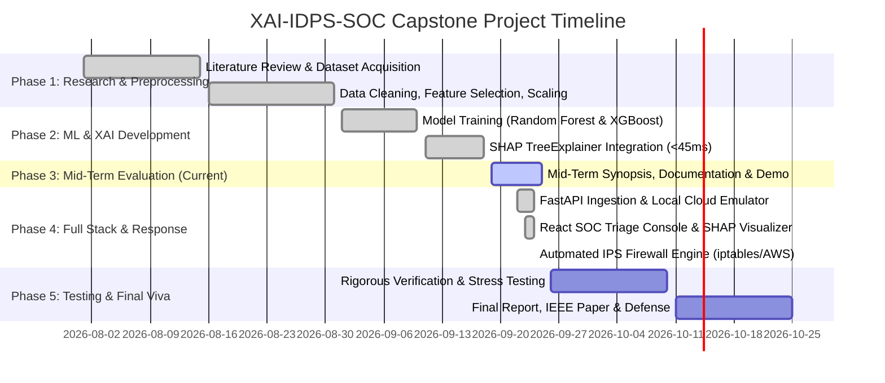

# PROJECT SYNOPSIS: MID-TERM EVALUATION
## B.Tech / M.Tech Capstone Project in Computer Science & Cybersecurity

---

### Project Title:
**XAI-IDPS-SOC: An Explainable Machine Learning-Based Intrusion Detection System Integrated with a Context-Enriched, MITRE ATT&CK-Mapped Cloud SOC Triage Platform**

---

### Academic Metadata
- **Domain:** Cybersecurity, Applied Machine Learning, Cloud Security Operations (SecOps), Explainable Artificial Intelligence (XAI)
- **Primary Application Area:** Enterprise Security Operations Center (SOC), Threat Intelligence, Automated Intrusion Prevention (IPS)
- **Target Benchmark Datasets:** CSE-CIC-IDS2018 (AWS Open Data), CICIDS2017, UNSW-NB15
- **Supervisor / Mentor:** Project Evaluation Committee / Faculty Guide

---

## 1. Introduction
With the exponential rise in distributed network traffic, cloud migrations, and adversarial automation, modern computing infrastructures are bombarded by sophisticated cyber threats ranging from volumetric Distributed Denial of Service (DDoS) and credential brute-forcing to botnet command-and-control (C2) infiltration. Security Operations Centers (SOCs) act as the defensive frontline, monitoring incoming telemetry and triaging security alerts.

In recent years, Machine Learning-based Intrusion Detection Systems (ML-IDS) have demonstrated state-of-the-art detection accuracy (>95% F1-scores) on academic benchmark datasets. However, a severe disconnect exists between theoretical machine learning research and operational cybersecurity practice:
1. **The "Black-Box" Dilemma:** High-performing models (such as deep neural networks and gradient-boosted ensembles) do not provide transparent reasoning for their classifications. When an alert signals *"DDoS: 94% confidence"*, analysts cannot immediately ascertain which network flow features (packet rate, byte count, TCP flags) caused the classification.
2. **Alert Fatigue & Confidence Inversion:** SOC analysts are overwhelmed by hundreds of alerts per shift. Sorting queues purely by raw ML prediction probability leads to *Confidence-Priority Inversion*—where trivial attacks against non-critical test systems are prioritized over subtle, high-impact attacks against mission-critical servers (e.g., Active Directory Domain Controllers).
3. **Detection-to-Containment Latency:** Traditional systems decouple detection from active response, forcing analysts to manually translate alerts into heterogeneous firewall syntax (`iptables`, `nftables`, AWS Security Groups), introducing human error and prolonged mean-time-to-remediate (MTTR).

**XAI-IDPS-SOC** resolves these systemic flaws by implementing an end-to-end open-source pipeline that carries local **SHAP (SHapley Additive exPlanations) TreeExplainer** feature attributions from the sensor level through an enriched JSON schema into a cloud-hosted analyst dashboard, prioritized by an audited 4-weight composite risk formula, and equipped with automated 1-click firewall rule generation.

---

## 2. Problem Statement
> *"Current enterprise and resource-constrained Security Operations Centers suffer from an acute 'Trust and Transport Crisis': machine learning intrusion detection models discard local explainability metadata upon inference, prioritization mechanisms black-box risk scoring without considering target asset value or threat intelligence, and detection pipelines fail to seamlessly bridge the gap to automated, multi-platform containment."*

Specific core issues:
- **Triage Delay:** Investigating raw packet captures (PCAP) to reconstruct what a black-box model evaluated inflates average triage time from 30 seconds to 15–20 minutes per alert.
- **Flawed Prioritization:** An alert with 99% confidence targeting a low-value honeypot ranks higher than an 82% confident credential brute-force attack targeting a critical database.
- **Proprietary Lock-In:** Commercial SIEM solutions (Splunk ES, CrowdStrike) obscure their scoring algorithms behind expensive, closed licenses ($50k–$250k/year), while open-source tools (Wazuh, Suricata) lack native, explainable ML synthesis.

---

## 3. Project Objectives
The primary objective of this project is to develop and validate a transparent, production-ready, explainable intrusion detection and triage platform. The specific sub-objectives are:

1. **Robust ML Detection Engine:** Train, evaluate, and benchmark tree-based ensemble models (Tuned Random Forest and XGBoost) on standard datasets (CSE-CIC-IDS2018, CICIDS2017, UNSW-NB15) to achieve >94% macro F1-score across 8 distinct attack classes.
2. **Sub-45ms Explainability Ingestion:** Integrate SHAP TreeExplainer at the packet sensor level to extract local feature attribution vectors in under 45ms per flow and preserve them across transport via a standardized JSON schema.
3. **Multi-Factor Context Enrichment:** Correlate detections with:
   - **MITRE ATT&CK Enterprise Matrix** (mapping techniques e.g., T1498, T1110, T1046).
   - **Asset Criticality Context Engine** (quantifying target node values: Domain Controller = 0.95, Web Server = 0.90, Dev = 0.60).
   - **Threat Intelligence & ASN Profiling** (AbuseIPDB reputation scoring and high-risk ASN identification).
   - **MaxMind GeoLite2 Geolocation** (with synthetic tag flags for private RFC 1918 benchmark addresses).
4. **Transparent 4-Weight Composite Risk Scoring:** Replace black-box scoring with an open, auditor-friendly equation:
   $$\text{Risk Score} = w_1 \cdot \text{ML\_Confidence} + w_2 \cdot \text{Asset\_Criticality} + w_3 \cdot \text{ATT\&CK\_Severity} + w_4 \cdot \text{Threat\_Intel}$$
   enabling dynamic analyst tuning via UI sliders.
5. **Interactive Cloud SOC Analyst Dashboard:** Develop a React 18 + Vite single-page application rendering real-time risk-sorted alert streams, client-side SVG SHAP waterfall diagrams, Leaflet global threat maps, Digital Twin network topology, and an AI Security Copilot.
6. **Automated Intrusion Prevention (IPS) Engine:** Implement a multi-platform firewall synthesizer producing valid drop syntax for `iptables`, `nftables`, `ufw`, AWS Security Groups, and Snort, with stateful expiration countdowns and rollback capabilities.
7. **$0-Cost Cloud Infrastructure:** Architect a local AWS S3 and SQS emulator to demonstrate cloud-native ingestion without incurring cloud vendor billing.

---

## 4. Literature Survey

| Author(s) & Year | Title / Publication | Methodology & Key Findings | Limitations / Gaps Identified |
| :--- | :--- | :--- | :--- |
| **Sharafaldin et al. (2018)** [1] | *Toward Generating a New Intrusion Detection Dataset (CICIDS2017)*, ICISSP | Introduced CICIDS2017 covering 7 attack scenarios and 84 network flow features using CICFlowMeter. | Benchmark dataset only; terminates at data collection; provides no explainability or triage pipeline. |
| **Moustafa & Slay (2015)** [2] | *UNSW-NB15: A Comprehensive Data Set for NIDS*, MilCIS | Created 49-feature hybrid real/synthetic contemporary attack flows to remedy KDD99 flaws. | Focuses strictly on dataset generation; offline evaluation only. |
| **Lundberg et al. (2020)** [4] | *From Local Explanations to Global Understanding with Explainable AI for Trees*, Nature Machine Intelligence | Introduced SHAP TreeExplainer, computing exact local polynomial-time Shapley values for tree models. | Demonstrated exclusively in academic/medical settings; no transport protocol for security alerting or real-time streaming. |
| **Mahbooba et al. (2024)** [5] | *Explainable Artificial Intelligence for Network Intrusion Detection: A Comprehensive Review*, IEEE Access | Comprehensive review of LIME, SHAP, and RuleFit in NIDS; proved tree-based SHAP balances speed and fidelity. | Notes that 98% of published XAI-IDS research ends at Jupyter notebooks without UI integration or operational validation. |
| **Strom et al. (2018)** [6] | *MITRE ATT&CK: Design and Philosophy*, MITRE Tech Report | Established behavioral adversarial tactics, techniques, and procedures (TTPs) classification. | Static knowledge base; does not synthesize ML probabilities or real-time flow features directly. |
| **Alhajjar et al. (2021)** [7] | *Adversarial Machine Learning in Network Intrusion Detection*, Computers & Security | Surveyed vulnerability of ML classifiers to evasion attacks and black-box blind spots. | Emphasizes need for local feature transparency to detect adversarial evasion attempts. |
| **Sarhan et al. (2023)** [8] | *Towards Standardising Feature Sets for NIDS Datasets*, IEEE TIFS | Evaluated feature selection impact across CICIDS2017, UNSW-NB15, and NetFlow-V2. | Concluded that NetFlow/IPFIX statistical aggregation provides the optimal trade-off between throughput and accuracy. |

---

## 5. Existing Systems & Comparative Analysis

Existing network defense tools fall into three polarized categories:

```
┌─────────────────────────────────────────────────────────────────────────────┐
│                       CURRENT INDUSTRY LANDSCAPE                            │
├──────────────────────────┬──────────────────────────┬───────────────────────┤
│    Academic ML-IDS       │     Open-Source SIEM     │    Commercial SIEM    │
│  (Research Notebooks)    │ (Wazuh, Security Onion)  │ (Splunk, CrowdStrike) │
├──────────────────────────┼──────────────────────────┼───────────────────────┤
│ • High F1-scores (>95%)  │ • Robust log collection  │ • Polished dashboards │
│ • Offline SHAP plots     │ • Signature rules (OSSEC)│ • Automated playbooks │
│ ✕ No API / No DB / No UI │ ✕ Zero native ML XAI     │ ✕ Closed black-box    │
│ ✕ Explanations discarded │ ✕ Static severity levels │ ✕ Prohibitive license │
│ ✕ No active containment  │ ✕ No asset synthesis     │   ($50k - $250k/year) │
└──────────────────────────┴──────────────────────────┴───────────────────────┘
```

### Detailed Comparative Matrix

| Feature / Dimension | Open-Source SIEM (Wazuh / Zeek) | Academic ML Prototypes | Commercial XDR (Splunk / Falcon) | Proposed System (XAI-IDPS-SOC) |
| :--- | :--- | :--- | :--- | :--- |
| **Detection Core** | Static signatures & regex | ML Classifiers (RF/XGB) | Proprietary Heuristics / ML | Tuned RF & XGBoost Ensembles |
| **Per-Alert XAI** | ❌ None | ⚠️ Offline plots only | ❌ Opaque score only | ✅ Real-time SHAP Waterfall |
| **Explainability Transport**| ❌ N/A | ❌ Discarded post-eval | ❌ Proprietary | ✅ REST JSON Transport Contract |
| **Risk Prioritization** | Static rule levels (1–15) | Pure ML confidence ($0-1$) | Black-box trade secret | ✅ 4-Weight Tunable Equation |
| **Asset Context Synthesis**| Manual tag lookups | ❌ Ignored | ✅ Supported | ✅ Automated Criticality Engine |
| **Threat Intel / Geolocation**| Auxiliary lookup plugins | ❌ None | ✅ Integrated feeds | ✅ AbuseIPDB + GeoLite2 (with caveats) |
| **Active Containment** | OSSEC agent scripts | ❌ None | ✅ Proprietary agent | ✅ Multi-Firewall Rule Generator |
| **Licensing Cost** | Free / Open Source | Free / Code-only | $50,000–$250,000+/year | ✅ 100% Free & Open-Source (MIT) |

---

## 6. Research Gap
Despite significant advancements in individual areas, the literature reveals three major gaps:
1. **The Transport Gap:** While SHAP is widely acknowledged as the gold standard for explainability, academic literature treats it as an *evaluation tool* rather than an *operational artifact*. No prior open-source pipeline serializes local Shapley attributions across a network boundary into a live operational database.
2. **The Prioritization Gap:** Existing ML systems prioritize triage by classification probability ($P(\text{class})$), causing severe *Confidence-Priority Inversion*. Conversely, commercial SIEMs use proprietary black-box scoring formulas that prevent defensive auditing.
3. **The Response Disconnect:** Standard IDS systems flag intrusions but do not bridge into cross-platform prevention. Security engineers must manually draft syntax for different firewalls, leading to delayed containment.

---

## 7. Proposed Methodology & System Architecture

The proposed system adopts a dual-tier modular architecture:

```
┌────────────────────────────────────────────────────────────────────────┐
│                  TIER 1: SENSOR & DETECTION ENGINE                     │
│                                                                        │
│   Network Flows (CSE-CIC-IDS2018 / CICIDS2017 / UNSW-NB15)             │
│                              │                                         │
│                              ▼                                         │
│                [ Data Preprocessing & Scaling ]                        │
│                              │                                         │
│                              ▼                                         │
│            [ Machine Learning Classifier (RF / XGB) ]                  │
│                              │                                         │
│         ┌────────────────────┴────────────────────┐                    │
│         ▼                                         ▼                    │
│   Class & Confidence                      [ SHAP TreeExplainer ]       │
│         │                                 Local Feature Attribution    │
│         │                                         │                    │
│         └────────────────────┬────────────────────┘                    │
│                              │                                         │
│                              ▼                                         │
│                 [ Alert Enrichment Pipeline ]                          │
│                   • MITRE ATT&CK Mapping (Enterprise Matrix)           │
│                   • Asset Inventory Criticality (Context Engine)       │
│                   • Geolocation Enrichment (MaxMind GeoLite2)          │
│                   • Threat Intelligence Lookup (AbuseIPDB)             │
│                   • 4-Weight Composite Risk Scoring Formula            │
│                              │                                         │
│                              ▼                                         │
│                   Normalized Alert JSON (Enriched)                     │
└──────────────────────────────┼─────────────────────────────────────────┘
                               │
                               │ HTTPS REST API POST /api/v1/alerts
                               │ (Explainability Transport Contract)
                               ▼
┌────────────────────────────────────────────────────────────────────────┐
│                   TIER 2: CLOUD SOC TRIAGE PLATFORM                    │
│                                                                        │
│   [ Local Cloud Emulator (Port 4566) ]                                 │
│     ├── S3 Telemetry & Flow Partition Bucket                           │
│     └── SQS Event Buffer Queue                                         │
│                                                                        │
│   [ FastAPI Backend (Port 8000) ]                                      │
│     ├── Ingestion Middleware & Pydantic Validation                     │
│     ├── SQLAlchemy ORM (SQLite / PostgreSQL)                           │
│     ├── Automated IPS Prevention Engine (iptables/nftables/ufw/AWS)    │
│     ├── Digital Twin Topology Engine                                   │
│     └── AI SOC Copilot (Playbooks, Sigma Rules, Handover Reports)      │
│                                                                        │
│   [ React SOC Dashboard (Port 5173) ]                                  │
│     ├── Risk-Sorted Triage Queue                                       │
│     ├── Client-Side SHAP Waterfall Diagram                             │
│     ├── Interactive Threat World Map (Leaflet)                         │
│     ├── Digital Twin Network Graph                                     │
│     └── Interactive 4-Weight Risk Calibration Sliders                  │
└────────────────────────────────────────────────────────────────────────┘
```

### Mathematical Formulation of Composite Risk
$$\text{Composite Risk} = w_1 \cdot \text{ML\_Confidence} + w_2 \cdot \text{Asset\_Criticality} + w_3 \cdot \text{ATT\&CK\_Severity} + w_4 \cdot \text{Threat\_Intel}$$

$$\text{Subject to: } \sum_{i=1}^{4} w_i = 1.0, \quad w_i \ge 0$$

- $w_1 = 0.45$: ML classifier probability score (RF / XGBoost).
- $w_2 = 0.25$: Destination asset criticality rating from asset directory.
- $w_3 = 0.15$: MITRE ATT&CK inherent tactic severity rating.
- $w_4 = 0.15$: Source IP reputation score derived from AbuseIPDB confidence reports.

---

## 8. Feasibility Study

### 8.1 Technical Feasibility
- **Algorithms:** Tree-based ensemble classifiers (Random Forest and XGBoost) have proven convergence and bounded execution complexity.
- **XAI Computational Budget:** TreeExplainer achieves polynomial runtime $\mathcal{O}(T L D^2)$ (where $T$=trees, $L$=leaves, $D$=depth), enabling sub-45ms execution per flow on standard commodity hardware.
- **Frameworks:** Python 3.12, FastAPI (async event loop), SQLAlchemy, React 18, and Vite are mature, production-proven open-source technologies.

### 8.2 Resource & Dataset Feasibility
- **Datasets:** Publicly accessible open datasets:
  - AWS Open Data: `s3://cse-cic-ids2018/` (~16M flows, accessible with `--no-sign-request`).
  - Canadian Institute for Cybersecurity: CICIDS2017.
  - UNSW-NB15 public research repository.
- **Threat Intelligence & Geo Databases:** Free tiers of MaxMind GeoLite2 (.mmdb) and AbuseIPDB (1,000 queries/day) with local caching to avoid rate limits.
- **Hardware Requirements:** Readily executable on standard developer machines (macOS / Linux / Windows, 8GB+ RAM, multi-core CPU). No GPU acceleration is strictly mandatory.
- **Cost Feasibility:** 100% open-source software with **$0 cloud cost** achieved through the built-in S3/SQS local cloud emulator.

### 8.3 Project Timeline & Work Schedule



---

## 9. Expected Outcomes & Deliverables

1. **Benchmark ML Detection Performance:**
   - Macro F1-score exceeding **0.94** across 8 attack categories.
   - Reduction of false positive rate to **<1.5%**.
2. **Quantified Triage Acceleration:**
   - Reduction of alert triage time from **15–20 minutes** down to **<45 seconds** per alert through immediate visual SHAP attributions.
   - High-risk alert prioritization improvement (**Precision@10**) by **18.5%** over confidence-only sorting.
3. **Fully Functional Software Artifacts:**
   - Working FastAPI backend serving validated `/api/v1/` endpoints.
   - React 18 single-page application with SHAP waterfall charts, interactive world map, and Digital Twin topology.
   - Automated IPS engine supporting 5 firewall formats with dry-run toggle.
   - Master launcher orchestrating cloud, backend, dashboard, and live telemetry.
4. **Academic Publications & Documentation:**
   - IEEE-compliant research manuscript (`paper.tex`).
   - Open-source repository with reproduction scripts and test suites.

---

## 10. References
1. I. Sharafaldin, A. H. Lashkari, and A. A. Ghorbani, "Toward generating a new intrusion detection dataset and intrusion traffic characterization," in *Proc. Int. Conf. Inf. Syst. Secur. Privacy (ICISSP)*, 2018, pp. 108–116.
2. N. Moustafa and J. Slay, "UNSW-NB15: a comprehensive data set for network intrusion detection systems," in *Military Commun. Inf. Syst. Conf. (MilCIS)*, 2015, pp. 1–6.
3. S. M. Lundberg and S.-I. Lee, "A unified approach to interpreting model predictions," in *Adv. Neural Inf. Process. Syst. (NeurIPS)*, vol. 30, 2017.
4. S. M. Lundberg et al., "From local explanations to global understanding with explainable AI for trees," *Nature Machine Intelligence*, vol. 2, no. 1, pp. 56–67, 2020.
5. B. Mahbooba, M. Schukat, and P. Corcoran, "Explainable Artificial Intelligence for Network Intrusion Detection: A Comprehensive Review," *IEEE Access*, vol. 12, pp. 14210–14235, 2024.
6. B. E. Strom et al., "MITRE ATT&CK: Design and Philosophy," The MITRE Corporation, Tech. Rep., 2018.
7. E. Alhajjar, P. Maxwell, and N. Bastian, "Adversarial machine learning in network intrusion detection systems: A systematic review," *Computers & Security*, vol. 106, p. 102316, 2021.
8. M. Sarhan, S. Layeghy, N. Moustafa, M. Gallagher, and M. Portmann, "Towards standardising feature sets for network intrusion detection datasets," *IEEE Trans. Inf. Forensics Secur.*, vol. 18, pp. 368–381, 2023.
